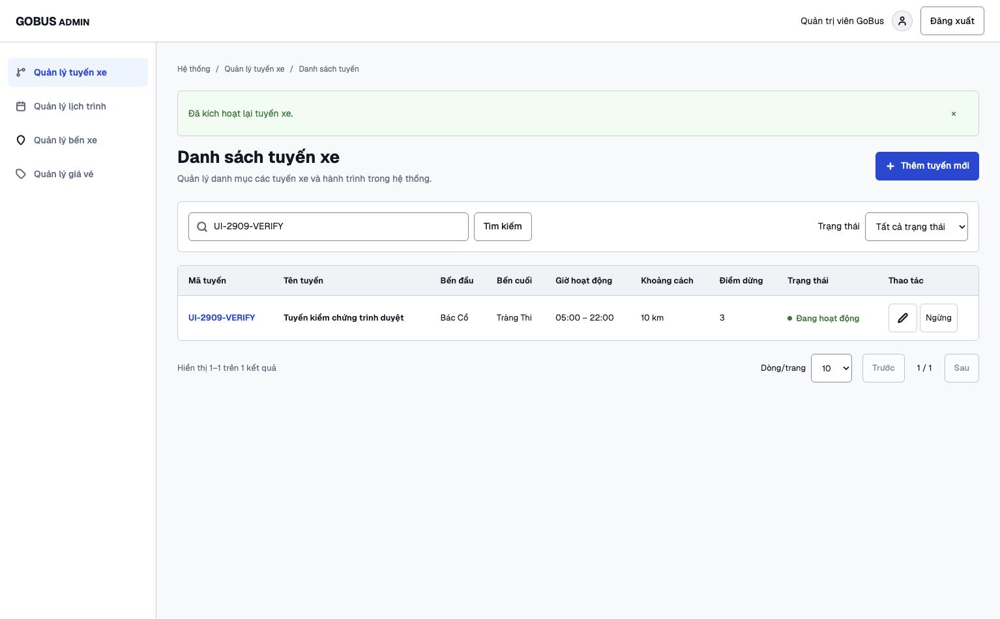
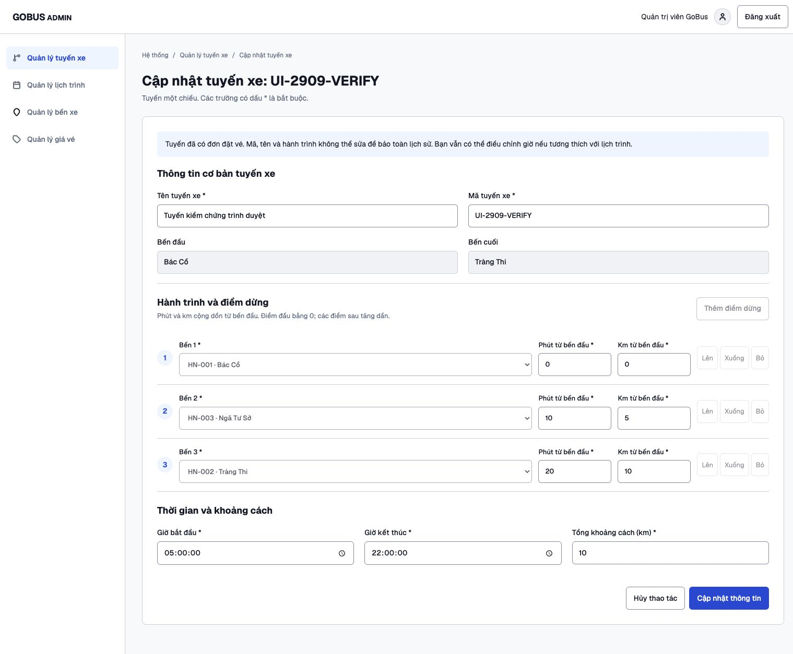
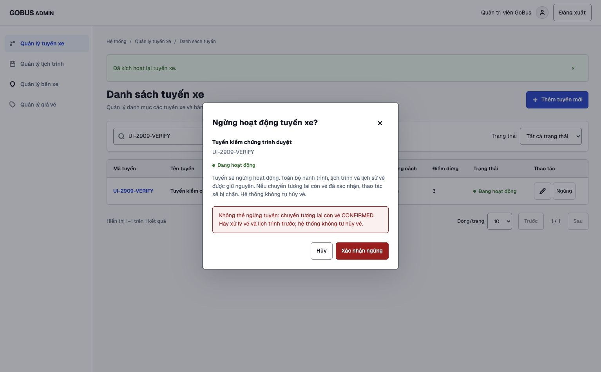

# Kiểm chứng tuyến và điểm dừng

Ngày 29/09/2026, đối chiếu đặc tả `0002-routes-stops-management.md` trên DB MySQL local hiện có. Không reset DB, không chạy seed, không đổi volume. Bản thay đổi nằm trên nhánh làm việc, chưa commit/push.

## Kết quả tự động

| Kiểm tra | Kết quả |
|---|---|
| Backend build, oxlint | Đạt |
| Backend unit | 1/1 |
| Backend E2E MySQL thật | 72/72: routes 24, stations 47, app 1 |
| Frontend build, ESLint | Đạt |
| Frontend Vitest/Testing Library | 15/15: routes 7, stations 8 |
| Migration 005 chạy lần đầu và chạy lại | Đạt, chỉ bổ sung cột thiếu; checksum cột gốc khớp |
| Git diff whitespace | Đạt |

Routes E2E kiểm tra trim/giới hạn/mã trùng, tìm kiếm ký tự LIKE, phân trang/trạng thái/chi tiết; lặp bến, thứ tự hỏng, endpoints sai, phút/km không tăng, điểm đầu khác 0, tổng km không khớp, giờ qua đêm, null, ID sai; bến ngừng; vé CONFIRMED/CANCELLED khóa lịch sử; chặn ngừng tuyến có vé tương lai; giờ lịch trình UTC+7 (kể cả biên chính xác), thời lượng; rollback sau khi đã thay stops; giữ stop IDs khi sửa metadata; dữ liệu cũ thiếu phút; quyền ADMIN, 400/401/403/404/409 và header bảo vệ request.

Test ghi đồng thời bao gồm ngừng bến với tạo tuyến, sửa hành trình, kích hoạt tuyến, và tạo trùng mã. Kiểm tra trực tiếp DB sau cuộc đua để không tồn tại tuyến ACTIVE dùng bến inactive.

Đã phát hiện và sửa lỗi so TIME với chuỗi tại biên giờ lịch trình bằng `CAST(? AS TIME(3))`; test biên 08:00 đến 08:20 hiện đạt. Đã chuyển snapshot hành trình ra trước transaction ghi để không chiếm hai connection đồng thời cho mỗi mutation.

## Kiểm chứng Chrome với API thật

Fixture riêng `UI-2909-VERIFY`, chỉ tham chiếu bến gốc để đọc. Đã thực hiện:

1. Đăng nhập ADMIN bằng session hiện có, xem danh sách thật.
2. Mở form thêm, chọn bến thật. Gửi km cuối 10 nhưng tổng 11, nhận đúng lỗi backend và giữ nguyên input.
3. Sửa tổng thành 10, lưu thành công, tìm kiếm tuyến vừa tạo.
4. Sửa hành trình, thêm bến thứ ba và chuyển lên vị trí 2. Lưu rồi đọc chi tiết: Bác Cổ 0 phút/0 km, Ngã Tư Sở 10 phút/5 km, Tràng Thi 20 phút/10 km.
5. Ngừng và kích hoạt lại qua hộp thoại, trạng thái cập nhật thành công.
6. Thêm schedule/booking CONFIRMED chỉ cho fixture. Ngừng bị chặn với giải thích rõ, trạng thái giữ ACTIVE. Mở sửa: mã và phút bị khóa theo lịch sử.
7. Chuyển sang module stations, tìm HN-001, mở và hủy form thêm bến; giữ nguyên dữ liệu bến.
8. Kiểm tra layout desktop và viewport 390×844: form xếp dọc, danh sách thành thẻ, chi tiết đọc được. Đã reset viewport. Console không có error/warn; các icon của form tải thành công.

Sau kiểm chứng đã khởi động lại backend bản build mới, đăng nhập lại và xác nhận danh sách 10 tuyến gốc. [Ảnh màn hình hiện tại](reviews/routes/desktop-current.png).

Các frame Figma đã đọc qua công cụ: 84:7, 84:126, 84:234, 84:346. Đối chiếu card, form, bảng, màu nút, khoảng cách và dialog. Khác biệt có chủ đích được ghi trong đặc tả: dùng shell stations, bổ sung khoảng cách/phút theo DB, trạng thái thay xóa, thêm chi tiết chưa có frame.

[Ảnh chi tiết trên điện thoại](reviews/routes/mobile-detail.png).

## Bảo toàn dữ liệu và giới hạn

Đã dọn chính xác fixture trình duyệt và fixture E2E. So với backup trước migration, SHA256 toàn bộ các cột gốc khớp: 10 routes, 43 route_stops, 60 schedules, 5 bookings, 33 stations, 3 users, 10 vehicles. Mỗi E2E còn đối chiếu riêng toàn bộ hàng có trước suite. Không hoàn nguyên auto increment để tránh ảnh hưởng dữ liệu đồng thời.

Dữ liệu cũ thiếu phút vẫn giữ NULL. Tuyến có lịch sử vé không được dùng form này để suy đoán/hiệu chỉnh phút. Đây là giới hạn bảo toàn lịch sử, đã thể hiện trong giao diện.

DB local không có fares: có guard cho bảng fares nếu tồn tại, nhưng chưa kiểm thử tích hợp nhánh này trên một DB có fares thật. Không kiểm thử tải quy mô production. Session memory và yêu cầu cấu hình production giữ nguyên giới hạn của module stations. Các thao tác SQL trực tiếp hay module lịch trình/đặt vé tương lai phải tuân thủ quy ước khóa mới được bảo vệ đầy đủ.
